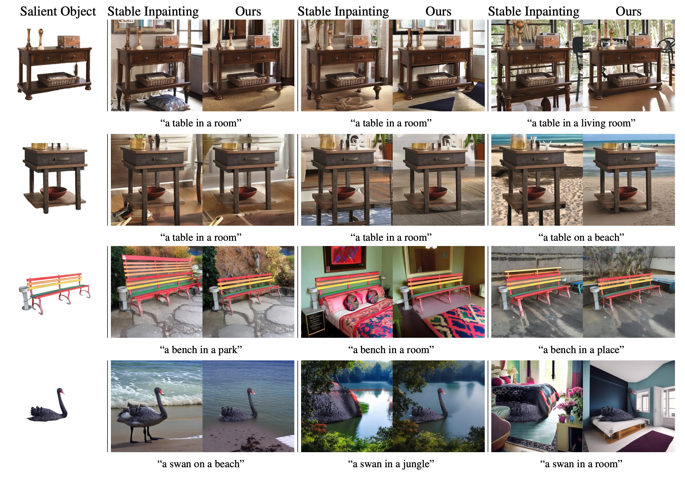

# Salient Object Aware Background Generation [](https://arxiv.org/pdf/2404.10157.pdf) [](https://huggingface.co/yahoo-inc/photo-background-generation)
This repository accompanies our paper, [Salient Object-Aware Background Generation using Text-Guided Diffusion Models](https://arxiv.org/abs/2404.10157), which has been accepted for publication in [CVPR 2024 Generative Models for Computer Vision](https://generative-vision.github.io/workshop-CVPR-24/) workshop. You can try our model on [Huggingface](https://huggingface.co/yahoo-inc/photo-background-generation).

The paper addresses an issue we call "object expansion" when generating backgrounds for salient objects using inpainting diffusion models. We show that models such as [Stable Inpainting](https://huggingface.co/stabilityai/stable-diffusion-2-inpainting) can sometimes arbitrarily expand or distort the salient object, which is undesirable in applications where the object's identity should be preserved, such as e-commerce ads. Some examples of object expansion:

<div align="center">
  
</div>


## Setup

The dependencies are provided in `requirements.txt`, install them by:

```bash
pip install -r requirements.txt
```

## Usage
### Training

The following runs the training of text-to-image inpainting ControlNet initialized with the weights of "stable-diffusion-2-inpainting":
```bash
accelerate launch --multi_gpu --mixed_precision=fp16 --num_processes=8 train_controlnet_inpaint.py --pretrained_model_name_or_path "stable-diffusion-2-inpainting" --proportion_empty_prompts 0.1
```

The following runs the training of text-to-image ControlNet initialized with the weights of "stable-diffusion-2-base":
```bash
accelerate launch --multi_gpu --mixed_precision=fp16 --num_processes=8 train_controlnet.py --pretrained_model_name_or_path "stable-diffusion-2-base" --proportion_empty_prompts 0.1
```

### Inference

Please refer to `inference.ipynb`. Tu run the code you need to download our model checkpoints. You can also try our model using Huggingface pipeline:

```
from diffusers import DiffusionPipeline
pipeline = DiffusionPipeline.from_pretrained("yahoo-inc/photo-background-generation")
```

## Models Checkpoints

| Model link                                       | Datasets used                                                                                                                                                                                      |
|--------------------------------------------------|-----------------------------------------------------------------------------------------------------------------------------------------------------------------------------------------------------------|
| [controlnet_inpainting_salient_aware.pth](https://drive.google.com/file/d/1ad4CNJqFI_HnXFFRqcS4mOD0Le2Mvd3L/view?usp=sharing)     | Salient segmentation datasets, COCO |

## Citations

If you found our work useful, please consider citing our paper:

```bibtex
@misc{eshratifar2024salient,
      title={Salient Object-Aware Background Generation using Text-Guided Diffusion Models}, 
      author={Amir Erfan Eshratifar and Joao V. B. Soares and Kapil Thadani and Shaunak Mishra and Mikhail Kuznetsov and Yueh-Ning Ku and Paloma de Juan},
      year={2024},
      eprint={2404.10157},
      archivePrefix={arXiv},
      primaryClass={cs.CV}
}
```

## Maintainers

- Erfan Eshratifar: erfan.eshratifar@yahooinc.com
- Joao Soares: jvbsoares@yahooinc.com

## License

This project is licensed under the terms of the [Apache 2.0](LICENSE) open source license. Please refer to [LICENSE](LICENSE) for the full terms.
